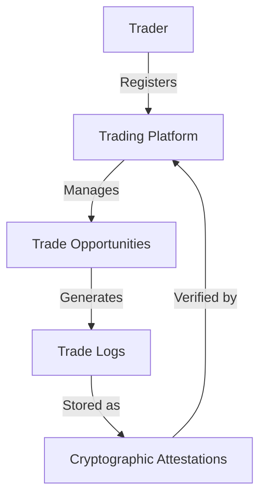

# Arbitrage Cleaner

A blockchain-based smart contract for tracking, validating, and resolving cross-chain arbitrage opportunities using the Stacks blockchain. This system provides traders with a secure, transparent mechanism to log and verify potential arbitrage transactions across multiple blockchain networks.

## Overview

The Arbitrage Cleaner creates an immutable record of potential arbitrage opportunities by storing cryptographic proofs on the Stacks blockchain. It addresses critical challenges in cross-chain trading:

- Secure tracking of arbitrage opportunities
- Transparent transaction verification
- Prevention of duplicate arbitrage claims
- Privacy-preserving trade logging

Key features:
- Trader registration
- Trade opportunity management
- Secure trade logging with cryptographic attestations
- Verification capabilities for historical trade states

## Architecture

The system consists of a single smart contract that manages trader registration and trade logging. The architecture follows a decentralized verification model where:

1. Traders can register their trading credentials
2. Multiple trade opportunities can be logged per trader
3. Trade activities are recorded as cryptographic attestations



## Contract Documentation

### home-iot-logger

The main contract handling all IoT logging functionality.

#### Data Storage
- `nest-nodes`: Maps owner principals to NestNode information
- `devices`: Stores registered device information
- `activity-logs`: Contains cryptographic proofs of device activities
- `owner-devices`: Tracks all devices registered to each owner

#### Access Control
- Only registered NestNode owners can register devices and log activities
- Each device can only be registered once per owner
- Activity logs are immutable once recorded

## Getting Started

### Prerequisites
- Clarinet
- Stacks wallet
- Cross-chain trading credentials

### Installation

1. Clone the repository
2. Install dependencies with Clarinet
```bash
clarinet integrate
```

### Basic Usage

1. Register as a trader:
```clarity
(contract-call? .arbitrage-cleaner register-trader "trader-unique-id")
```

2. Register a trading opportunity:
```clarity
(contract-call? .arbitrage-cleaner register-trade "trade-id" "ETH-BTC Opportunity" "cross-chain")
```

3. Log trade details:
```clarity
(contract-call? .arbitrage-cleaner log-trade-activity "trade-id" u1234567890 0x... 0x...)
```

## Function Reference

### Registration Functions

```clarity
(register-nest-node (nest-node-id (string-ascii 64)))
```
Registers a new NestNode system for the homeowner.

```clarity
(register-device (device-id (string-ascii 64)) (device-name (string-ascii 64)) (device-type (string-ascii 32)))
```
Registers a new IoT device to the homeowner's network.

### Logging Functions

```clarity
(log-device-activity (device-id (string-ascii 64)) (timestamp uint) (action-hash (buff 32)) (attestation-hash (buff 32)))
```
Records an activity attestation for a device.

### Query Functions

```clarity
(get-nest-node-info (owner principal))
(get-device-info (owner principal) (device-id (string-ascii 64)))
(get-owner-devices (owner principal))
(get-activity-log (owner principal) (device-id (string-ascii 64)) (timestamp uint))
```

### Verification Functions

```clarity
(verify-activity-attestation (owner principal) (device-id (string-ascii 64)) (timestamp uint) (provided-attestation-hash (buff 32)))
(was-device-active (owner principal) (device-id (string-ascii 64)) (timestamp uint))
```

## Development

### Testing

Run the test suite:
```bash
clarinet test
```

### Local Development
1. Start Clarinet console:
```bash
clarinet console
```

2. Deploy contract:
```bash
clarinet deploy
```

## Security Considerations

### Limitations
- Maximum 100 trades per trader
- Trade logs are permanent and cannot be deleted
- Only hash-based trade attestations are stored on-chain

### Best Practices
- Generate strong, unique trade identifiers
- Securely store off-chain trade details
- Regularly verify trade attestations
- Keep trading credentials secure
- Implement robust hash generation for trade proofs

### Privacy
- No sensitive trading data is stored on-chain
- Only cryptographic hashes are recorded
- Trade opportunities can only be verified with knowledge of the original data